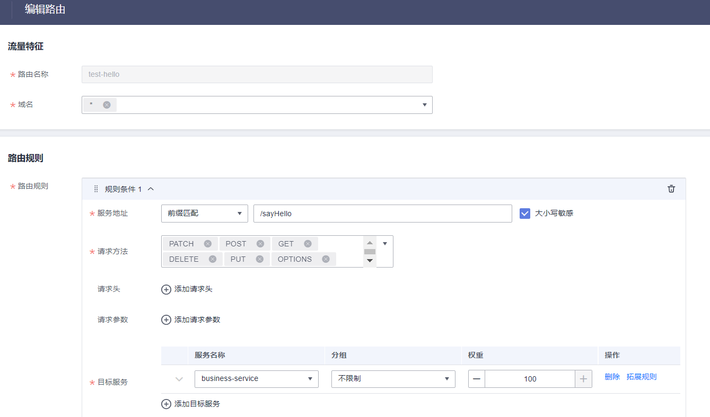
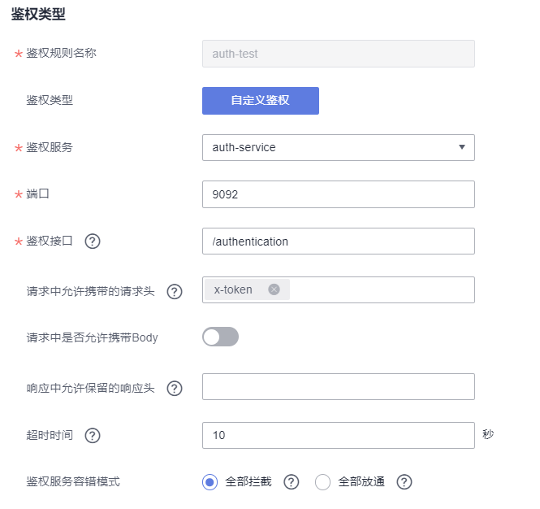
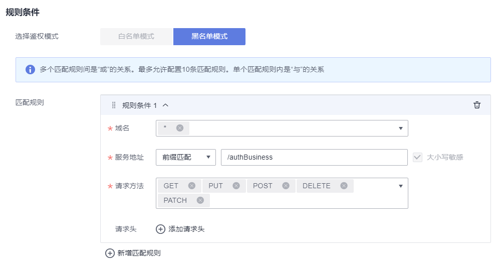

# 项目说明

这个项目提供了 Spring Cloud Huawei 适配应用网关的自定义鉴权能力的简单例子，例子包括：

* auth-service
  使用 Spring Cloud 开发一个 REST 接口进行鉴权。

* auth-business-service
  使用 Spring Cloud 开发一个 REST 业务接口。

* un-auth-service
  使用 Spring Cloud 开发一个 REST 业务接口。

## 使用
  demo依托CSE(Nacos)、应用网关的使用能力，实现应用网关的自定义鉴权能力，具体配置及实现如下。

* 前提条件
  [准备应用部署虚拟机](/ECS-ENV_CN.md)  

  [准备应用网关运行环境](/GATEWAY-ENV_CN.md)

  [准备CSE(Nacos)运行环境](/NACOS-ENV_CN.md)

  注意：ECS、应用网关、Nacos引擎的虚拟私有云VPC要相同。

* 项目编译
  mvn clean package

## 服务启动
  在申请的ECS节点启动服务时，需要通过环境变量注入Nacos引擎的地址 -DCSE_NACOS_ADDRESS=华为云Nacos内网地址:8848

* 启动 auth-service
  
  进入目录 ${Project}/auth-service/target/

      java -jar -DCSE_NACOS_ADDRESS=华为云Nacos内网地址:8848 auth-service-1.0-SNAPSHOT.jar

* 启动 auth-business-service

  进入目录 ${Project}/auth-business-service/target/

      java -jar -DCSE_NACOS_ADDRESS=华为云Nacos内网地址:8848 auth-business-service-1.0-SNAPSHOT.jar

* 启动 un-auth-service

  进入目录 ${Project}/un-auth-service/target/

      java -jar -DCSE_NACOS_ADDRESS=华为云Nacos内网地址:8848 un-auth-service-1.0-SNAPSHOT.jar

  注意：验证查看微服务是否已经注册到Nacos引擎。

## 应用网关设置自定义鉴权
  
* 路由管理
  域名管理: 使用网关默认的http请求协议；
  服务来源: 创建来源=》来源类型选择Nacos引擎、来源名称自定义、引擎实例选择已创建Nacos引擎、命名空间选择微服务注册命名空间。
  服务管理: 创建服务=》选择已创建的服务来源、服务列表勾选引擎已注册服务、定义服务名；
  路由设置: 设置路由名称、选择域名、服务地址设置对应请求url、勾选对应服务，如下图：
  

* 自定义鉴权
  访问控制=》认证鉴权=》创建鉴权规则
  鉴权类型: 
      自定义鉴权规则名称、选择鉴权服务、填写鉴权服务端口；
      请求中允许携带的请求头: 当请求需要携带header时，该项需要填写对应的key, 否则header无法透传, 例如demo中要使用header的x-token作为获取token来源，该项填写x-token
      鉴权接口: 定义鉴权接口时注意，页面定义的url会在业务请求时，自动拼接在业务接口前面，请求鉴权服务，如页面设置鉴权接口 /authentication, 业务接口 /authBusiness, 
        那么鉴权服务中定义的鉴权接口就是/authentication/authBusiness
  条件规则: 
      黑名单模式=》新增匹配规则
      选择http请求域名、请求方法全选；
      服务地址: 改项填写的是需要鉴权的url，如果配置为 *，通过网关的请求都需要完成鉴权才能通过，如果配置为前缀 /authBusiness，那么鉴权只会针对满足条件的url生效，其他请求不会经过鉴权服务。

## 结果验证

* 鉴权服务对所有请求生效
  鉴权接口: /authentication
  条件规则服务地址: *
  
  ECS节点访问网关: curl -kv -H "x-token:auth2024" http://xxx.xxx.xxx.xx:80/authBusiness?name=2222
  业务正常返回: Hello 2222; server port: 9094

  ECS节点访问网关: curl -kv -H "x-token:auth2023" http://xxx.xxx.xxx.xx:80/authBusiness?name=2222
  业务正常返回: 403 Forbidden

  ECS节点访问网关: curl -kv -H "x-token:auth2023" http://xxx.xxx.xxx.xx:80/unAuthBusiness?name=2222
  业务正常返回: 404 Not Found

* 鉴权服务对某个url生效
  鉴权接口: /authentication
  条件规则服务地址: 前缀 /authBusiness

  ECS节点访问网关: curl -kv -H "x-token:auth2024" http://xxx.xxx.xxx.xx:80/authBusiness?name=2222
  业务正常返回: Hello 2222; server port: 9094

  ECS节点访问网关: curl -kv -H "x-token:auth2023" http://xxx.xxx.xxx.xx:80/authBusiness?name=2222
  业务正常返回: 403 Forbidden

  ECS节点访问网关: curl -kv http://xxx.xxx.xxx.xx:80/unAuthBusiness?name=2222 或者 curl -kv -H "x-token:auth2023" http://xxx.xxx.xxx.xx:80/unAuthBusiness?name=2222
  业务正常返回: Hello 2222; server port: 9096